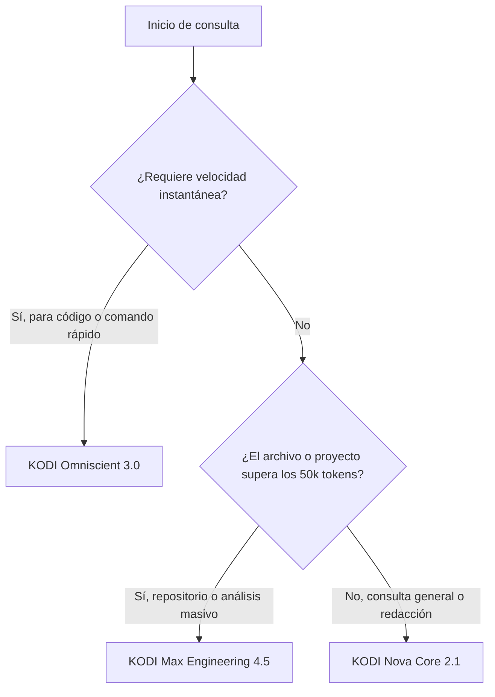

# MODELS: Especificación y Guía de Modelos KODI

KODI AI Studio incorpora tres arquitecturas complementarias para ofrecer equilibrio entre velocidad extrema, capacidad de razonamiento y ventana de contexto masiva.

---

## 🔬 1. Catálogo Técnico de Modelos

### 1.1 KODI Nova Core 2.1
- **Proveedor Base**: Google Gemini API
- **Especialización**: Análisis conceptual, redacción literaria y técnica, lógica general y resolución de dudas.
- **Velocidad de Inferencia**: Media (~1.5s a 3.5s primer token).
- **Ventana de Contexto**: Más de 100,000 tokens.
- **Ideal para**:
  - Resúmenes de textos extensos y documentos científicos.
  - Explicaciones pedagógicas y tutorías para estudiantes.
  - Traducción con matices idiomáticos y redacción de informes ejecutivos.

### 1.2 KODI Omniscient 3.0
- **Proveedor Base**: Groq LPU Engine (Llama 3.3 70B Versatile)
- **Especialización**: Generación y depuración de código en tiempo real, latencia ultra-baja.
- **Velocidad de Inferencia**: Ultra-rápida (menos de 400ms por respuesta).
- **Ventana de Contexto**: 32,000 tokens.
- **Ideal para**:
  - Pair programming en vivo y corrección de sintaxis inmediata.
  - Consultas breves tipo terminal (comandos bash, expresiones regulares, SQL).
  - Tareas repetitivas que demandan velocidad inmediata sin esperas.

### 1.3 KODI Max Engineering 4.5
- **Proveedor Base**: Google Gemini Pro Advanced
- **Especialización**: Ingeniería de sistemas, auditoría de seguridad, refactorización de repositorios completos.
- **Velocidad de Inferencia**: Media-Alta (~3s a 6s con razonamiento exhaustivo).
- **Ventana de Contexto**: Más de 1,000,000 de tokens.
- **Ideal para**:
  - Ingesta de código de aplicaciones completas con múltiples módulos.
  - Diseño de esquemas de bases de datos distribuidas y microservicios.
  - Análisis forense de fallos, auditoría de vulnerabilidades y optimización de rendimiento.

---

## 📊 2. Matriz Comparativa

| Criterio | KODI Nova Core 2.1 | KODI Omniscient 3.0 | KODI Max Engineering 4.5 |
| :--- | :--- | :--- | :--- |
| **Enfoque Principal** | General / Redacción / Lógica | Código rápido / Terminal | Ingeniería compleja / Big Context |
| **Tiempo de Respuesta** | 2-3 segundos | < 0.5 segundos | 3-5 segundos |
| **Ventana de Tokens** | 100,000+ | 32,000 | 1,000,000+ |
| **Capacidad Multimodal** | Texto + Documentos | Código / Texto puro | Código masivo / Documentos / Datos |
| **Consumo de Créditos** | Estándar (1x) | Rápido (1x) | Especializado (2x) |

---

## 💡 3. Guía de Decisión: ¿Cuándo usar cada modelo?



---

## 🛠️ 4. Ejemplos de Prompting por Modelo

### KODI Nova Core 2.1
```text
Actúa como un profesor universitario de física cuántica. Explica el entrelazamiento cuántico usando analogías cotidianas accesibles para un alumno de secundaria.
```

### KODI Omniscient 3.0
```text
Escribe un script en Bash para monitorear el uso de CPU y memoria cada 5 segundos, guardando los picos superiores al 80% en un log con timestamp.
```

### KODI Max Engineering 4.5
```text
Analiza la siguiente arquitectura de microservicios en Docker Swarm con PostgreSQL y Redis. Identifica cuellos de botella en concurrencia y propón una estrategia de particionado horizontal (sharding) con código de migración.
```

[Siguiente: Arquitectura Técnica del Sistema ➔](./ARCHITECTURE.md)
